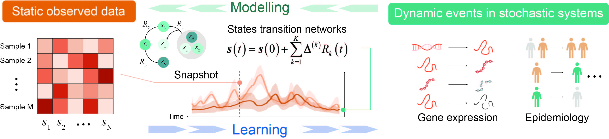
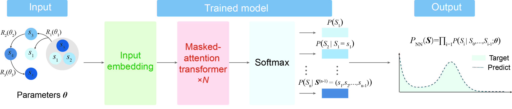
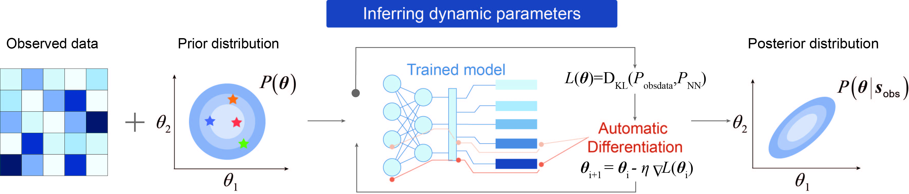

.. DynGPT documentation master file, created by
   sphinx-quickstart on Tue Jan 14 16:22:48 2025.
   You can adapt this file completely to your liking, but it should at least
   contain the root `toctree` directive.

Welcome to DynGPT's documentation!
------------------------------------

.. image:: https://img.shields.io/pypi/v/burstlink
   :target: https://github.com/cellfateTX/
   :alt: PyPI

.. image:: https://img.shields.io/pypi/pyversions/burstlink
   :target: https://github.com/cellfateTX/
   :alt: PyPI - Python Version

.. image:: https://img.shields.io/pypi/wheel/burstlink
   :target: 
   :alt: PyPI - Wheel

.. image:: https://img.shields.io/github/downloads/LiyingZhou12/BurstLink/total
   :target: 
   :alt: Downloads

.. raw:: html

   <h1 style="font-size: 30px;">Overview of DynGPT framework</h1>

**DynGPT**  is a GPT-driven framework designed to solve generalized multi-dimensional state transition networks (STNs) and learn 
stochastic dynamics from static observed data. 

**DynGPT** consists of two core modules: DynGPT-Solver and DynGPT-Inferrer. DynGPT-Solver effectively captures the complex dynamical
properties of stationary distributions in intractable STNs across parameter spaces. Leveraging the trained DynGPT-Solver and neural
approximate Bayesian computation (NeuralABC), DynGPT-Inferrer efficiently and accurately estimates the posterior distributions of STN parameters
from multi-dimensional static observed data.

DynGPT-Solver: solving the stationary distribution of the state transition networks
~~~~~~~~~~~~~~~~~~~~~~~~~~~~~~~~~~~~~~~~~~~~~~~~~~~~~~~~~~~~~~~~~~~~~~~~~~~~~~~~~~~~~~~~~

Solving the steady-state distribution of complex STNs remains challenging, as analytical solutions are often intractable, while numerical
approaches typically require significant computational resources or compromise accuracy for efficiency. To address this, DynGPT-Solver 
employs an autoregressive transformer-based architecture
to efficiently solve the joint stationary distribution of multi-dimensional STNs. 

DynGPT-Inferrer: learning stochastic dynamic from static observed data
~~~~~~~~~~~~~~~~~~~~~~~~~~~~~~~~~~~~~~~~~~~~~~~~~~~~~~~~~~~~~~~~~~~~~~~~~

Understanding how stochasticity enhances robustness and flexibility is a key focus in systems dynamics research, requiring 
the modeling and inference of underlying stochastic mechanisms from observed data. DynGPT-Inferrer efficiently estimates the Bayesian posterior distributions of STN parameters by utilizing automatic differentiation and 
NeuralABC.

Reference
~~~~~~~~~~~~~~~~~

DynGPT: a generative AI framework for learning stochastic dynamics from static data through state transition networks

.. toctree::
   :maxdepth: 2
   :caption: Contents

   installation
   tutorials/index
   docs/source/modules
